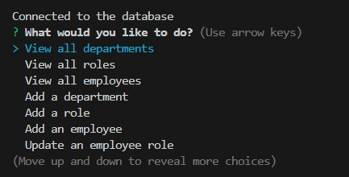

# Employee Tracker

## Description 
The Employee Tracker is a command-line application that allows you to manage employees, roles, and departments within a company database.

## Installation
1. Clone the repository to your local computer
2. Open the project in the integrated terminal
3. Run the following command: 
    npm i
4. Edit the database configurations in a .env file at the project root directory to match your own credentials: 
5. Run the following sql script: 
    source schema.sql
    source seeds.sql

## Usage
To run the application, run the following command in the terminal:
    npm run start

## Licence
N/A

